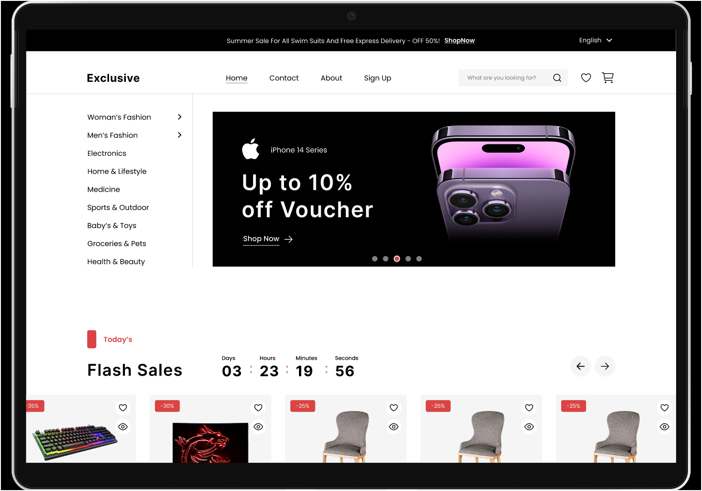
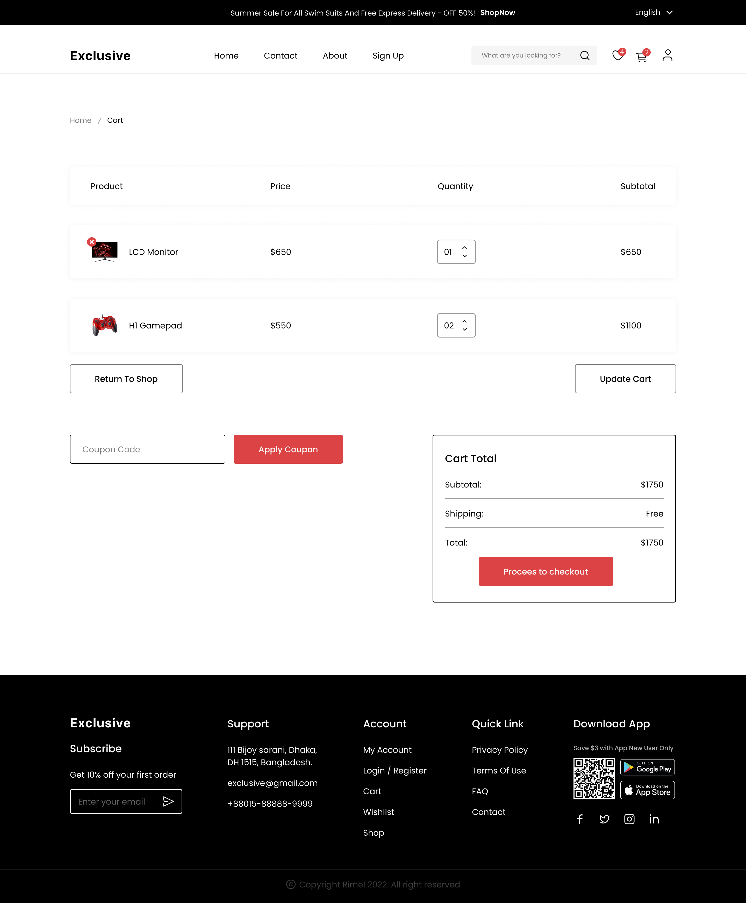

# E-Commerce Website 🙌

Website E-commerce ini merupakan aplikasi full-stack yang dibangun menggunakan React dengan Vite sebagai bundler. Untuk tampilan, digunakan Tailwind CSS dan Material UI, sehingga menghasilkan antarmuka yang modern dan menarik. Platform ini menyediakan fitur-fitur utama seperti pendaftaran dan login agar pengguna dapat mengakses akun mereka, halaman wishlist dan keranjang untuk mengelola barang, fungsi pencarian untuk memudahkan menemukan produk, serta bagian profil untuk personalisasi. Selain itu, terdapat proses checkout yang mendukung penggunaan kupon dan pembelian, sehingga memastikan pengalaman belanja yang lancar bagi pelanggan.


  

## [🌟Live Website🌟](https://e-commerce-mansy.vercel.app)

## [🌟Design on Figma 🌟](https://www.figma.com/file/yn2DFQJla0UiSMvomFsqwT/E-Commerce-Website-%D9%90Almdrasa?type=design&mode=design&t=fqPRRAQH5lDJGmoY-0)

## Table of Contents

- [Features](#features)
- [Technologies Used](#technologies-used)
- [Set Up ](#set-up)
- [Screenshots](#screenshots)
- [Contact](#contact)


## Featured Skills

1. **React**: Utilized for building the frontend interface, providing dynamic and interactive components.
2. **Vite**: Employed as the build tool to optimize and bundle the project for production.
3. **Tailwind CSS**: Integrated for responsive and customizable styling, enhancing the visual aesthetics of the website.
4. **Material UI**: Leveraged for pre-designed components and UI elements, facilitating rapid development and maintaining consistency in design.
5. **Full-stack Development**: Implemented both frontend and backend functionalities, ensuring end-to-end functionality and user experience.
6. **User Authentication**: Implemented signup and login features to authenticate users and secure their accounts.
7. **Wishlist and Cart Management**: Developed functionalities to add, remove, and update items in the wishlist and cart, enhancing user engagement and convenience.
8. **Search Functionality**: Implemented a search feature to enable users to find products efficiently based on their preferences.
9. **Checkout Process**: Designed a seamless checkout process with support for applying coupons and completing purchases, streamlining the buying journey for users.

## Technologies Used

- **React**: JavaScript library for building user interfaces.
- **Vite**: Fast, modern build tooling for frontend development.
- **Tailwind CSS**: Utility-first CSS framework for rapid UI development.
- **Material-UI**: React components for faster and easier web development.
- **Custom Hooks**: Utilized custom React hooks for managing state and logic efficiently.
- **Git** (for version control)
- **Responsive For Mobile**

## Set Up

To set up and run the project locally, follow these steps:

1. Clone the repository to your local machine:

   ```bash
   git clone https://github.com/MMansy19/E-Commerce-Website.git
   ```

2. Navigate to the project directory:

   ```bash
   cd E-Commerce-Website
   ```

3. Install the project dependencies:

   ```bash
   npm install
   ```

4. Install `i18next` for internationalization:

   ```bash
   npm install i18next
   ```

5. Install `react-i18next` for React integration with i18next:

   ```bash
   npm install react-i18next
   ```

6. Install `flowbite-react` for UI components:

   ```bash
   npm install flowbite-react
   ```

7. Start the development server:
   ```bash
   npm run dev
   ```


## Screenshots
1. E-Commerce HomePage
  
2. Sign Up
  
3. Log In
  
4. Product Details page
  
5. Wishlist
  
6. About
  
7. Cart
  
8. CheckOut
  
9. Contact
  
10. Account
  

